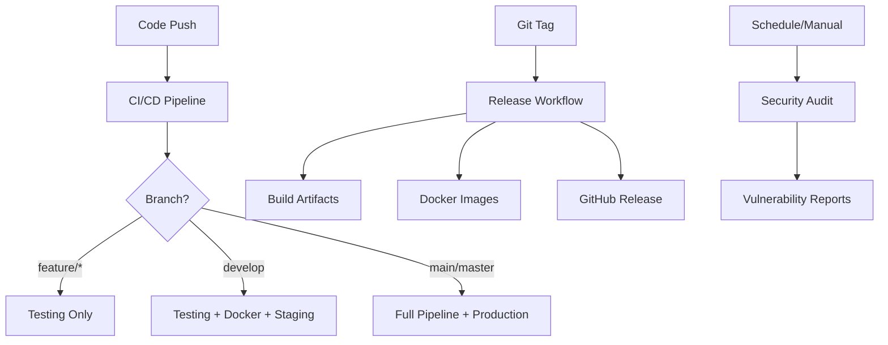

# 🚀 GitHub Actions Workflows

Kumpulan lengkap workflow GitHub Actions untuk CI/CD pipeline aplikasi Employee Management System.

## 📋 Workflow Overview

### 1. 🔄 CI/CD Pipeline (`ci-cd.yml`)
**Trigger:** Push/PR ke main, master, develop

Workflow utama yang menjalankan:
- ✅ Code quality check (linting, TypeScript)
- 🧪 Testing suite (Playwright E2E tests)
- 🔒 Security scanning (npm audit, Snyk)
- 🐳 Docker build & test
- 🚀 Build & push images (main/master)
- 📊 Performance testing
- 📧 Notifications

**Jobs:**
1. **lint-and-format** - ESLint, TypeScript check, build test
2. **test** - Playwright tests across browsers (Chrome, Firefox, Safari)
3. **security** - npm audit, Snyk security scan
4. **docker-build** - Docker Compose testing, Trivy security scan
5. **build-and-push** - Push images to GHCR (main/master only)
6. **deploy-staging** - Deploy to staging (develop branch)
7. **deploy-production** - Deploy to production (main/master, manual)
8. **performance** - Lighthouse CI performance testing
9. **notify** - Send notifications and create summary

### 2. 🧪 Testing Suite (`testing.yml`)
**Trigger:** Push/PR dengan perubahan src/, tests/, atau config

Fokus pada comprehensive testing:
- 🚀 Quick validation (TypeScript, lint)
- 🎭 E2E tests matrix (5 browsers x 3 OS)
- 👁️ Visual regression testing
- 🔌 API endpoint testing
- ⚡ Performance testing

**Features:**
- Parallel execution untuk efisiensi
- Cross-browser testing (Chromium, Firefox, WebKit, Mobile)
- Cross-platform testing (Ubuntu, Windows, macOS)
- Visual diff detection
- API health checks

### 3. 🐳 Docker Build & Deploy (`docker.yml`)
**Trigger:** Push ke main/master, Docker file changes

Comprehensive Docker workflow:
- 🏗️ Multi-stage builds (production & development)
- 🧪 Docker Compose testing
- 🔒 Container security scanning (Trivy, Grype)
- 🚀 Image publishing ke GHCR
- 📦 Build attestation
- 🧹 Automated cleanup

**Images Built:**
- `ghcr.io/[repo]-frontend:latest` (production)
- `ghcr.io/[repo]-frontend-dev:latest` (development)

### 4. 🎉 Release (`release.yml`)
**Trigger:** Git tags (v*), manual dispatch

Automated release process:
- 📦 Create GitHub releases
- 🏗️ Build release artifacts
- 🐳 Tag & push Docker images
- 🧪 Full release testing
- 📝 Generate changelogs
- 📋 Deployment instructions

**Artifacts:**
- Application bundles (tar.gz)
- Source code archives
- Docker Compose bundles
- Deployment guides
- Checksums

### 5. 🔒 Security Audit (`security.yml`)
**Trigger:** Weekly schedule, dependency changes, manual

Comprehensive security scanning:
- 📦 Dependency vulnerabilities (npm audit)
- 🛡️ Advanced scanning (Snyk)
- 🐳 Container security (Trivy, Grype)
- 🔍 Code analysis (CodeQL, Semgrep)
- ⚙️ Configuration security

**Security Checks:**
- NPM package vulnerabilities
- Docker image CVEs
- Code security patterns
- Sensitive file detection
- Configuration best practices

## 🎯 Workflow Triggers

| Workflow | Push (main) | Push (develop) | PR | Schedule | Manual |
|----------|-------------|----------------|----|-----------|---------| 
| CI/CD    | ✅          | ✅             | ✅ | ❌        | ❌      |
| Testing  | ✅          | ✅             | ✅ | ❌        | ❌      |
| Docker   | ✅          | ❌             | ✅ | ❌        | ❌      |
| Release  | ✅ (tags)   | ❌             | ❌ | ❌        | ✅      |
| Security | ✅          | ❌             | ✅ | ✅ Weekly | ✅      |

## 🔧 Setup Requirements

### 1. Repository Secrets
```yaml
# Optional: Enhanced security scanning
SNYK_TOKEN: "your-snyk-token"
SEMGREP_APP_TOKEN: "your-semgrep-token"

# Auto-generated by GitHub
GITHUB_TOKEN: "auto-generated"
```

### 2. Branch Protection
Recommended branch protection untuk `main`/`master`:
- Require status checks: `lint-and-format`, `test`, `security`
- Require up-to-date branches
- Require signed commits (optional)

### 3. Environment Setup
```yaml
# .github/environments/staging.yml
staging:
  protection_rules:
    - type: required_reviewers
      count: 1

# .github/environments/production.yml  
production:
  protection_rules:
    - type: required_reviewers
      count: 2
    - type: wait_timer
      minutes: 5
```

## 🚀 Usage Examples

### Development Workflow
```bash
# 1. Create feature branch
git checkout -b feature/new-feature

# 2. Make changes dan commit
git add .
git commit -m "feat: add new feature"

# 3. Push branch (triggers testing)
git push origin feature/new-feature

# 4. Create PR (triggers full CI/CD)
# GitHub UI atau gh CLI
gh pr create --title "Add new feature"

# 5. Merge to develop (triggers staging deployment)
# 6. Merge to main (triggers production build)
```

### Release Process
```bash
# 1. Manual release
gh workflow run release.yml -f version=v1.2.0

# 2. Tag-based release  
git tag v1.2.0
git push origin v1.2.0

# 3. Check release
gh release view v1.2.0
```

### Security Monitoring
```bash
# Manual security scan
gh workflow run security.yml

# Check security artifacts
gh run download [run-id]
```

## 📊 Monitoring & Notifications

### Build Status Badges
```markdown


```

### Workflow Outputs
- ✅ **Test Reports**: Playwright HTML reports
- 📊 **Coverage Reports**: Code coverage metrics  
- 🔒 **Security Reports**: Vulnerability assessments
- 📦 **Build Artifacts**: Release bundles
- 🐳 **Docker Images**: Container registry

### Notifications
- 📧 **Summary Reports**: Job status di GitHub UI
- 🎯 **PR Comments**: Test results dan security findings
- 📋 **Issue Creation**: Automated untuk security vulnerabilities
- 📊 **Metrics**: Build times, test counts, security scores

## 🔄 Workflow Dependencies



## 🛠️ Customization

### Add New Test Environment
```yaml
# In testing.yml matrix
matrix:
  include:
    - os: ubuntu-latest
      browser: chromium
      env: staging
```

### Custom Security Rules
```yaml
# In security.yml
- name: Custom Security Check
  run: |
    # Your custom security validation
    ./scripts/custom-security-check.sh
```

### Environment-Specific Deployment
```yaml
# In ci-cd.yml
deploy-custom:
  if: github.ref == 'refs/heads/custom-branch'
  environment: custom-env
  steps:
    - name: Deploy to Custom Environment
      run: |
        # Custom deployment logic
```

## 📋 Best Practices

### 1. **Performance Optimization**
- Gunakan `cache: 'npm'` untuk Node.js setup
- Parallel execution untuk independent jobs
- Conditional runs dengan `if:` statements
- Artifact cleanup otomatis

### 2. **Security**
- Minimal secrets exposure
- Scan dependencies regularly
- Container security scanning
- Branch protection rules

### 3. **Reliability**
- `continue-on-error` untuk non-critical steps
- Timeout untuk long-running jobs
- Retry logic untuk network operations
- Comprehensive error handling

### 4. **Maintainability**
- Descriptive job names dengan emoji
- Comprehensive step summaries
- Artifact retention policies
- Documentation updates

## 🎯 Next Steps

1. **Setup Repository**: Configure secrets dan branch protection
2. **Test Workflows**: Commit changes untuk trigger workflows
3. **Monitor Results**: Check workflow runs dan artifacts
4. **Customize**: Adapt workflows untuk specific needs
5. **Scale**: Add more environments, tests, atau security checks

Workflows ini memberikan foundation yang solid untuk CI/CD pipeline yang professional dan scalable! 🚀